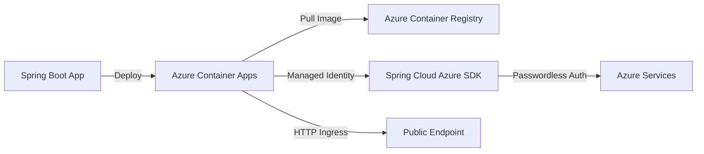

## Blog Article
> **Read the full article:** [A Spring Boot Devlopers guide to Azure Container Apps](https://akhan-2020.github.io/akhan-2020.github.io/2026/05/25/spring-boot-developers-guide-azure-container-apps/)

A complete Spring Boot sample application demonstrating deployment to Azure Container Apps with Managed Identity integration.

## Architecture



## What's Inside

- **Spring Boot 3.5** application with health probes
- **Jib Maven plugin** for containerization
- **Spring Cloud Azure** integration with Managed Identity
- **Bicep templates** for infrastructure deployment

## Quick Start

```bash
# Build and deploy to Azure
mvn clean package
az containerapp up \
  --name spring-demo-app \
  --resource-group my-rg \
  --location eastus \
  --source . \
  --ingress external \
  --target-port 8080
```

## License

MIT
